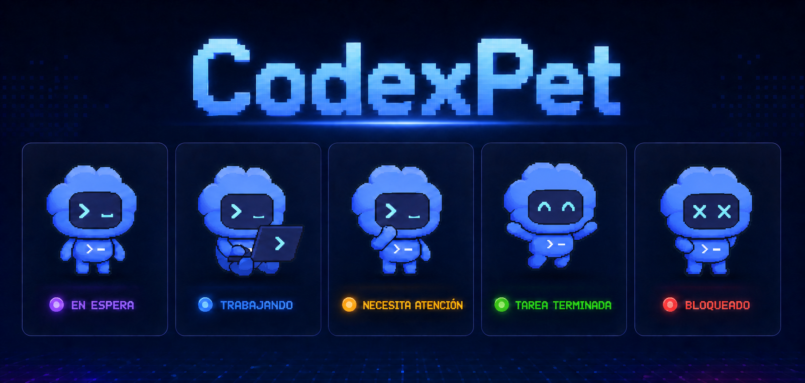

# CodexPet

[Documentación en español](README.es.md)

An animated Codex desktop pet for Windows. CodexPet detects Codex activity, reflects its state in real time, and stays visible on the desktop without interrupting your work.

> [!IMPORTANT]
> The official mascots and visual assets included with this project belong to OpenAI/Codex and their respective owners. CodexPet claims no authorship or ownership over them. It is an independent, unofficial project that provides an alternative way to display them on Windows.



## Features

- Visual states tied to real Codex events: idle, working, attention required, task complete, blocked/error, and offline.
- Eight selectable pets: Codex, BSOD, Dewey, Fireball, Null Signal, Rocky, Seedy, and Stacky.
- A stable single window even when Codex creates temporary helper processes.
- Persistent position, size, language, and selected pet across sessions and updates.
- Per-user automatic startup with Windows.
- Manual update checks through GitHub Releases.
- English and Spanish interface, switchable from the context menu.
- Localized About dialog with the author and official mascot attribution.
- Per-user installation without administrator privileges.

## Requirements

- Windows 10 or Windows 11.
- Windows PowerShell 5.1 or PowerShell 7.
- A working Codex installation that runs `codex.exe`.
- Internet access only for checking or downloading updates.

## Installation

1. Open the [latest release](https://github.com/ezenwa/CodexPet/releases/latest).
2. Download `CodexPet-Setup.exe`.
3. Run the installer and choose English or Spanish.

CodexPet is installed in `%LOCALAPPDATA%\CodexPet`. The Inno Setup installer creates Desktop and Start menu shortcuts, registers the watcher at Windows startup, and provides a native uninstaller.

## Usage

- Drag the card with the left mouse button to move it.
- Resize it from the corners.
- Double-click it to open Windows Terminal with Codex.
- Right-click it to select a pet, change the language, manage Windows startup, check for updates, or close CodexPet.

### States

| State | Color | Meaning |
| --- | --- | --- |
| Idle | Purple | Codex is open and waiting for a request. |
| Working | Blue | A task is active. |
| Needs attention | Yellow | Codex is requesting approval or information. |
| Task complete | Green | The task completed successfully. |
| Blocked | Red | The task failed or was interrupted. |
| Offline | Gray | No active Codex process was detected. |

## Updates

Open the context menu and select **Check for updates**. CodexPet only queries the latest public release of `ezenwa/CodexPet` through the GitHub API. If a newer version is available, it offers to open the official release page. It never downloads, installs, or runs an update automatically.

## Privacy and security

CodexPet locally processes structural event types from `%USERPROFILE%\.codex\sessions` to identify task state. It also reads local Codex SQLite telemetry to determine whether an approval is currently pending. It does not send prompts, responses, telemetry, or file contents anywhere. Update checks only send a standard HTTPS request to GitHub.

## Attribution

The pets distributed with CodexPet are official Codex visual assets. Their designs, names, and original files belong to OpenAI/Codex and their respective owners. This repository only presents them through an alternative desktop interface. CodexPet is not affiliated with, sponsored by, or officially endorsed by OpenAI.

## Development

The project is implemented with PowerShell and WPF and has no external runtime dependencies.

```powershell
powershell.exe -NoLogo -NoProfile -ExecutionPolicy Bypass -File .\CodexPet.ps1
```

To validate PowerShell syntax:

```powershell
$tokens = $null
$errors = $null
[System.Management.Automation.Language.Parser]::ParseFile((Resolve-Path '.\CodexPet.ps1'), [ref]$tokens, [ref]$errors) | Out-Null
$errors
```

Generating `dist\CodexPet-Setup.exe` and `dist\CodexPet-Setup.zip` requires [Inno Setup 6](https://jrsoftware.org/isinfo.php):

```powershell
.\Build-Release.ps1 -Version 1.2.3
```

## Architecture

- `CodexPet.ps1`: WPF window, animations, languages, and update checks.
- `CodexPet-State.ps1`: incremental event reader and mapping of real Codex events to visual states.
- `CodexPet-Watcher.ps1`: detects the Codex process group and maintains one pet instance.
- `installer/CodexPet.iss`: native installation and uninstallation through Inno Setup.
- `Stop-CodexPet.ps1`: controlled shutdown before updating or uninstalling.
- `assets/pets`: pet animation frames.

## Troubleshooting

- If the pet does not appear, confirm that `codex.exe` is running.
- If an update check fails, verify access to GitHub and try again from the context menu.
- The watcher log is stored at `%LOCALAPPDATA%\CodexPet\watcher.log`.
- To reinstall, run the latest installer. Your position, size, language, and selected pet are preserved.

## Releases

See [CHANGELOG.md](CHANGELOG.md) for the release history in English or [CHANGELOG.es.md](CHANGELOG.es.md) for the Spanish version.
